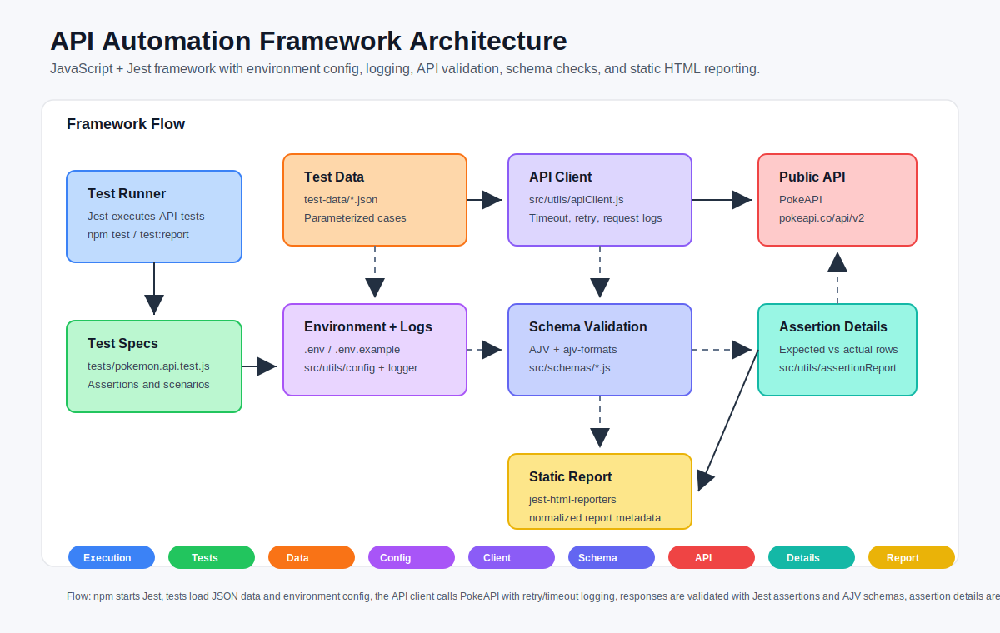

# Sporty Take Home API Automation

Assignment B API automation tests implemented in JavaScript with Jest.

## API Under Test

This project uses [PokeAPI](https://pokeapi.co/), a public API listed in the `public-apis/public-apis` repository. It was selected because it is HTTPS-based, does not require authentication, and provides stable resources suitable for deterministic automated validation.

## Prerequisites

- Node.js 18 or higher
- npm

## Setup

```bash
npm install
```

Create a local `.env` file from the example values if one is not already present.

Windows PowerShell:

```powershell
Copy-Item .env.example .env
```

Windows Command Prompt:

```bat
copy .env.example .env
```

macOS/Linux:

```bash
cp .env.example .env
```

## Run Tests

```bash
npm test
```

For verbose output:

```bash
npm run test:verbose
```

## Static HTML Report

Each test run generates a static HTML report here:

```text
reports/test-report.html
```

You can generate the report explicitly with:

```bash
npm run test:report
```

The report is based on the Jest assertions in the test files. Passed tests appear as successful scenarios. If an assertion fails, the report shows the failed test name, error message, and assertion details.

The parameterized Pokemon detail tests also attach assertion-level expected and actual values to the expanded report view. For example, the expanded report entry for Pikachu includes rows for `id`, `types`, `abilities`, `height`, `weight`, `stats`, and default sprite URL.

After a successful Jest run, `scripts/normalizeReportStatus.js` normalizes the generated report metadata so the report data matches the visible pass/fail result.

## Configuration

The defaults work without any local configuration.

| Variable | Default | Description |
| --- | --- | --- |
| `API_BASE_URL` | `https://pokeapi.co/api/v2` | Base URL for the API under test |
| `API_TIMEOUT_MS` | `15000` | Request timeout in milliseconds |
| `API_RETRY_COUNT` | `2` | Retry count for transient network errors |
| `LOG_LEVEL` | `info` | Logger level: `debug`, `info`, `warn`, `error`, or `silent` |
| `LOG_API_REQUESTS` | `false` | Set to `true` to log API request and response metadata |

Numeric configuration values are validated at startup. Invalid timeout, retry count, base URL, or log level values fail fast with a clear error.

## Project Structure

```text
artifacts/
  framework-architecture.svg
  Sporty API Automation Test Report sample.pdf
src/
  schemas/
    pokemonSchemas.js
  utils/
    apiClient.js
    assertionReport.js
    config.js
    logger.js
scripts/
  normalizeReportStatus.js
test-data/
  pokemon.test-data.json
tests/
  pokemon.api.test.js
```

Pokemon lookup test inputs are kept in `test-data/pokemon.test-data.json` so new parameterized cases can be added without changing the test logic.

## Framework Architecture



## Sample Report Artifact

A sample exported report is available at:

```text
artifacts/Sporty API Automation Test Report sample.pdf
```

## Written Test Cases

| ID | Scenario | Endpoint | Expected Result | Validation Used |
| --- | --- | --- | --- | --- |
| API-001 | Get Pokemon by valid names using parameterized data | `GET /pokemon/{name}` | Each requested Pokemon returns the expected identity, physical attributes, type, abilities, stats, and sprite URL | HTTP status, JSON content type, exact field assertions, array assertions, object assertions, and URL assertion |
| API-002 | Get Pokemon by ID | `GET /pokemon/25` | Pikachu is returned with expected species, forms, moves, and sprite details | HTTP status, exact value assertions, array membership assertions, nested object assertions, and URL assertions |
| API-003 | Validate Pokemon detail response schema | `GET /pokemon/25` | Pokemon detail response follows the expected API contract | AJV JSON schema validation for required fields, data types, arrays, nested named resources, stats, types, abilities, moves, species, and sprites |
| API-004 | Verify paginated Pokemon list | `GET /pokemon?limit=5&offset=0` | First page returns 5 Pokemon records with correct pagination metadata | HTTP status, numeric assertion, null assertion, exact array length assertion, and result item format assertion |
| API-005 | Validate paginated Pokemon list response schema | `GET /pokemon?limit=5&offset=0` | Pokemon list response follows the expected pagination contract | AJV JSON schema validation for `count`, `next`, `previous`, and `results` named resources |
| API-006 | Get Pokemon type details | `GET /type/electric` | Electric type details are returned and include Pikachu in the linked Pokemon list | HTTP status, exact value assertion, object assertion, non-empty array assertion, and array membership assertion |
| API-007 | Validate Pokemon type response schema | `GET /type/electric` | Pokemon type response follows the expected API contract | AJV JSON schema validation for type identity, damage relation arrays, and linked Pokemon resources |
| API-008 | Request invalid Pokemon | `GET /pokemon/not-a-real-pokemon-qa` | API rejects an unknown Pokemon with `404` | Negative status assertion and unsuccessful response assertion |

## Validation Used and Why

| Validation Type | Where It Is Used | Why It Is Used |
| --- | --- | --- |
| HTTP status validation | All positive and negative tests | Confirms the API accepts valid requests with `200` and rejects invalid resources with `404` |
| JSON content-type validation | Pokemon detail tests | Confirms successful API responses are returned in a consumable JSON format |
| Exact value validation | Pokemon detail and type tests | Confirms the API returns the expected business data, not just a successful response code |
| Array and nested object validation | Abilities, types, stats, moves, forms, species, pagination results, and linked Pokemon | Confirms important nested response structures are present and populated correctly |
| URL and URI validation | Sprite URLs, resource URLs, pagination links, and schema checks | Confirms returned links are correctly formatted and usable by API consumers |
| JSON schema validation with AJV | Pokemon detail, Pokemon list, and Pokemon type responses | Confirms the response contract has the expected required fields, data types, nested structure, and minimum array sizes |
| Negative validation | Invalid Pokemon lookup | Confirms the API handles invalid input correctly and does not return a false positive success response |
| Parameterized validation with `test.each` | Valid Pokemon lookup test | Reduces duplicated code while validating multiple Pokemon records with the same behavior and different expected data |

These validations cover transport-level behavior, business-level correctness, and response contract stability. This combination helps catch cases where an endpoint returns `200` but the response body is incomplete, incorrectly typed, missing required fields, or semantically wrong.

The parameterized test names include the key details being validated, so the HTML report shows readable scenarios such as the Pokemon ID, type, abilities, height, weight, and speed.

## Local Test Run GIF

Add the required assignment GIF here after recording a local test run:

```md

```
